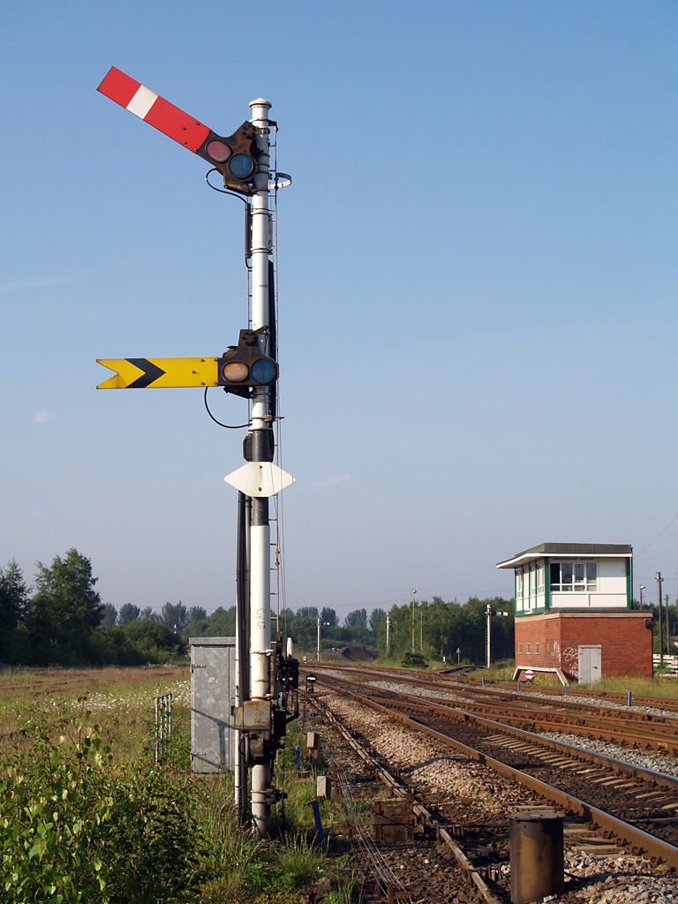

# 27 RTOS 线程间同步通信机制

27课，Miro Samek讲解了RTOS中并发线程同步与通信的机制。这些机制是任何 RTOS 中最复杂的部分，通常很难自己开发。因此，Samek用专业级的 QXK RTOS（包含在 QP/C 框架中）替换之前用的 MiROS RTOS。

Samek展示了如何将现有应用移植到不同的RTOS，由于和主题不想关，这里略过。之后学习信号量，并用一个简单的开关控制LED做了展示：
https://github.com/QuantumLeaps/modern-embedded-programming-course/tree/main/lesson-27/tm4c123-qxk-keil

## 信号量
26节课实现了抢占式、基于优先级的调度器，并学习了速率单调调度技术。这种技术可以为线程分配优先级，使它们都能满足硬实时截止时间。但“blinky”线程仍然不够真实，因为它们完全独立运行。

可以把这种情况类比为火车在完全独立的环形轨道上运行——就像线程里的无限 `while(1)` 循环。

现实中，无论是线程还是火车都不会完全独立运行，它们的轨道会在不同地方交叉，需要同步和通信来保证及时服务并避免碰撞。铁路用信号量/信号机(semaphore signals)解决了这个问题，信号量可以是打开或关闭。如果信号量关闭，任何接近的火车都必须停下等待信号量打开；如果打开，火车就可以通过。下图是英国卡斯尔顿东交汇处的信号机。

 

信号量的概念在 1960 年代被荷兰计算机科学家 Edsger Dijkstra 引入软件领域，他为分时系统发明了软件信号量。后来，信号量被扩展到基于优先级的调度器和 RTOS，并在 1980 年代初成为主流。软件信号量的工作原理是什么呢？如何用它进行线程间信号传递呢？

### MiROS RTOS 切 QPC
略, 可以直接对比26课和27课的代码大致了解实现细节。

## 模拟火车与信号量
基于QPC的blinky项目实现，修改 `blinky2` 线程，使其只在按下 SW1 后才切换蓝色 LED。这模拟了现实中的火车与信号量场景。示意图如下：

对应的实现步骤：
1. 创建一个名为 `SW1_sema` 的 `QXSemaphore`。查阅 QP/C 在线文档。信号量包含一个计数和一个等待集合（被阻塞线程）。
2. 在 `main()` 里用 `QXSemaphore_init(&SW1_sema, 0U, 1U);` 初始化为二值信号量（计数为 0 或 1）。
3. 在 `blinky2` 里，用 `QXSemaphore_wait(&SW1_sema, QXTHREAD_NO_TIMEOUT);` 替换延时。
4. 处理 SW1 信号时，查看 LaunchPad 原理图。SW1 连接到 `PF4`，之前用作 `TEST_PIN`。移除 `TEST_PIN` 的相关代码。将 `PF4` 配置为带上拉的数字输入，设置下降沿中断检测。
5. 实现 `GPIOF_Handler` 作为 ISR。用 `QXK_ISR_ENTRY()` 和 `QXK_ISR_EXIT()`。在内部检查是否来自 `PF4` 的中断，清除中断，并用 `QXSemaphore_signal(&SW1_sema);` 向信号量发出信号。
6. 在 `QF_onStartup()` 里为该中断分配低于 `QF_AWARE_ISR_CMSIS_PRI` 的优先级，使其成为内核感知中断，并在 NVIC 里使能。
7. 在 `bsp.h` 里声明 `SW1_sema`，在它前面包含 `qpc.h`，并移除 `stdint.h`。

编译后用断点和逻辑分析仪测试信号量逻辑。最初蓝色 LED 不闪烁——直到你按下 SW1。按下后触发 GPIO ISR 并向信号量发送信号，`blinky2` 线程被唤醒（从阻塞状态切换准备运行状态）并运行。

逻辑分析仪显示精确时序：只有信号量发出信号后才切换。由于开关**抖动**，有时会快速发送多个信号。因为这是二值信号量，只能持有一个，多余信号会被丢弃。 实际生产代码必须**消除机械开关抖动**。

## 总结
27课简单地介绍了信号量、线程解阻，以及信号后优先级如何影响线程执行延迟。