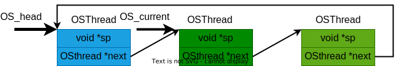

# 嵌入式RTOS - 线程轮转调度器

《现代嵌入式系统编程》23课中，Miro Samek构建了一个最小化的实时操作系统（MiROS）。此时，MiROS RTOS 已经可以表示线程数据、启动线程，并在多个线程之间进行上下文切换。但是，`OS_sched()` 函数中对下一个线程的选择仍然是手动完成的。

24课中，Miro Samek接着展示了**如何实现自动化调度**，实现了一个简单的**轮转调度器**，它按顺序循环运行线程。

项目实现见：
https://github.com/QuantumLeaps/modern-embedded-programming-course/tree/main/lesson-24/tm4c123-keil

## 简单的调度
在只有两个线程（`blinky1` 和 `blinky2`）的情况下，可以硬编码调度逻辑：
如果当前线程是 `blinky1`，就将 `OS_next` 设置为 `blinky2` 的地址；
否则，就设置为 `blinky1`。编译时你会发现出错，因为 `blinky1` 和 `blinky2` 对编译器来说是未定义的。可以通过 `extern` 声明来修复这一点。通常这种声明应写在头文件中，但为了测试目的，也可以直接放在源文件中。

## 轮转调度器 Round Robin
### 1. 定义数据结构存储OS_thread


有很多方法可以重构线程调度逻辑，一种常见方法是将所有线程存储在一个**链表**中，调度器依次遍历，如上图。
然而，由于线程简单且数量有限，MiROS采用更直接的方法：使用一个**预分配的数组 `OS_thread[]`**，其中保存所有通过 `OSThread_start()` 启动的线程指针。调度器将以**循环方式**遍历该数组。示意图如下：


为此，需要三个变量：
- 一个 `OS_thread[]` 数组，容量为 32+1 个线程指针；
- 一个计数器 `OS_threadNum`，用于记录已经启动了多少个线程；
- 一个当前线程索引变量 `OS_currIdx`，用于调度器中递增索引并循环使用。
当一个新线程启动时，指针将被存入 `OS_thread[]` 数组，并且 `OS_threadNum` 会递增。
此时我们**假设数组不会溢出**——但这个假设应该强制验证。

### 2. 更新OSThread_start
现在，在 `OSThread_start()` 中，线程指针会被存储进数组中，并计入计数器。调度器 `OS_sched()` 的逻辑也被简化为：递增 `OS_currIdx`，必要时循环归零，然后将 `OS_next` 设置为下一个线程。

这种设计允许你**从应用代码中删除线程名的硬编码**。例如，现在可以轻松添加一个第三个线程——`blinky3`，它控制红色 LED，以不同延迟闪烁，与其他线程共同组成彩色闪烁效果。所有改动都只涉及主应用文件，无需修改已有 RTOS 代码。
这种能力称为 *可组合性（composability）*，得益于 RTOS 的抽象。如果没有 RTOS，这些线程根本无法同时独立运行。

### 3. 配置RTOS启动时机
下一步，我们需要解决 **RTOS 启动时机** 的问题，特别是中断的配置和启用时机。目前中断是在 `BSP_init()` 中启用的，但这太早了。如果某个中断在 `main()` 还未完成时触发，就可能导致提前的上下文切换，从而破坏关键初始化。

**正确做法是等到所有线程启动后再启用中断**。因此，应将启用中断的逻辑从 `BSP_init()` 移动到 `main()` 最后，并替换原来的 `while(1)` 循环，调用一个新的 RTOS API：`OS_run()`。

`OS_run()` 函数将控制权交给 RTOS。它首先调用一个回调函数 `OS_onStartup()`，这个函数**必须由应用定义**（不由 RTOS 提供）。在这里你可以配置和启用中断。然后 `OS_run()` 会触发调度器（类似于 `SysTick_Handler()` 中的逻辑），但这次是在**中断上下文之外**。由于上下文切换只能在异常返回时发生，所以 `OS_run()` 会触发 `PendSV` 异常以实现“合法”的线程切换。

### 4. 实现`OS_onStartup()`
要完整实现这套逻辑，请在 `miros.h` 中声明新的 API 原型，如 `OS_run()` 和 `OS_onStartup()`。如果你忘了在 `bsp.c` 中实现 `OS_onStartup()`，编译器会报错，这正好提示你补充该函数。将原来 `BSP_init()` 中配置中断的代码移动到 `OS_onStartup()` 中。最后调用 `__enable_interrupts()` 是冗余的但不会出错。
`OS_onStartup()`实现如下：
```c
void OS_onStartup(void) {
    SystemCoreClockUpdate();
    SysTick_Config(SystemCoreClock / BSP_TICKS_PER_SEC);

    /* set the SysTick interrupt priority (highest) */
    NVIC_SetPriority(SysTick_IRQn, 0U);
}
```
### 5. 调试代码
一切准备就绪后，构建并调试代码。在 `OS_run()` 中设断点，观察它如何禁用中断并触发调度器，然后步入 `PendSV_Handler()`，看到它返回到 `blinky2` 线程。最后移除断点，观察红、绿、蓝三个 LED 同时闪烁，各由独立线程控制。

## 性能分析

现在 MiROS 已经具备自动运行能力，可以评估它的性能。将混合信号示波器和逻辑分析仪连接到红、绿、蓝 LED 引脚以及未用的 PF4 引脚作为测试引脚。

最初，由于 LED 闪烁速度太慢，难以测量上下文切换时间。解决方法是：**注释掉 `BSP_delay()` 调用**，让引脚不断切换。

为了观察上下文切换，在 `SysTick_Handler()` 中切换 PF4 引脚，并在 `BSP_init()` 中将 PF4 配置为输出。加载代码后，你会看到 LED 持续发光，快到肉眼无法分辨。逻辑分析仪上可见只有一个引脚在任意时刻变化，并且切换点对应于 PF4（D4） 活跃时。


设置 D4 的上升沿为触发点，放大观察波形：

* 从线程最后一次活动到 `SysTick` 中断，大约 **400ns**，对应 50 MHz 下的 **20 个时钟周期**
* `SysTick_Handler()` 自身执行约 **1.6µs**（80 周期）
* 后续的上下文切换耗时约 **1.5µs**（75 周期）

因此，总的上下文切换时间约为 **3.5µs（175 个时钟周期）**，在 50 MHz 下不到 CPU 一个周期（1 秒） 的 **0.04%**。即使在 1kHz 的系统 tick 频率下，RTOS 开销也保持在 **0.3% 以下**。

## 总结
24课实现了线程轮转调度器，但目前使用的 `BSP_delay()` 会浪费大量 CPU 时间。得益于已经实现的上下文切换机制，可以实现 *阻塞机制（blocking）* —— 一种更高效的等待方式：线程在等待时主动让出 CPU，直到延迟结束再恢复执行。这是25课的主题。
